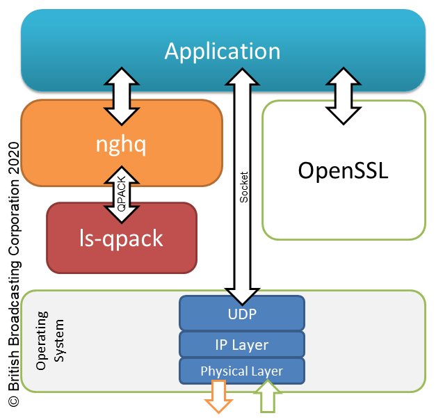

# nghq

**nghq** is a HTTP framing layer built on top of
[ngtcp2](https://github.com/ngtcp2/ngtcp2) and aims to provide support for the
HTTP/QUIC mapping for running HTTP over IETF QUIC.

The **nghq** API is modelled after that of
[nghttp2](https://nghttp2.org/documentation/). The application owns the
communicating socket and feeds data into the library via a series of calls.
The application is expected to act on callbacks from the library. There are a
couple of important points to note:

* **nghq** does not own the socket. The application is expected to read data
from the socket and provide it to the library. When the library has some data
to send, it will call back into the application with the data to be sent on the
application's socket.
* **nghq** does not do any encryption or decryption of the packets received.
It is up to the application to manage the TLS context. The encrypt and decrypt
callbacks will be fired when the library needs encryption or decryption to be
done.

The public API is documented [here](docs/public-api.md). In addition, the
library's public header file [nghq.h](include/nghq/nghq.h) has comment blocks
for every function and callback listed above it which also serve as
documentation.

Some helpful sequence diagrams, showing the expected interaction between a
client/server application and **nghq** can be found
[here](docs/sequence-diagrams.md).

## Caveats

**NOTE: In its current form, nghq implements only the parts of the HTTP/QUIC specification required by [draft-pardue-quic-http-mcast-02](https://tools.ietf.org/html/draft-pardue-quic-http-mcast-02)**.

In particular, it only supports [draft-ietf-quic-http-09](https://tools.ietf.org/html/draft-ietf-quic-http-09) 
as draft-09 is the last to still use [HPACK](https://tools.ietf.org/html/rfc7541)
for header compression. Later versions of quic-http mandate the use of
[QPACK](https://github.com/quicwg/base-drafts/blob/master/draft-ietf-quic-qpack.md).
However, there is currently no readily available QPACK encoder and decoder. 
Until such time as this issue is resolved, this library relies on the legacy
HPACK encoder and decoder from
[nghttp2](https://nghttp2.org/documentation/tutorial-hpack.html).

## Getting Started

**nghq** is currently designed to be built against a version of ngtcp2 that has
quic-transport-draft-09 support. The branch on ngtcp2 is called [nghq-0.0.1-support](https://github.com/davidjwbbc/ngtcp2/tree/nghq-0.0.1-support).

    $ git clone --depth 1 -b nghq-0.0.1-support https://github.com/davidjwbbc/ngtcp2.git

In addition, the library also requires [nghttp2](https://nghttp2.org) version
v1.11.0 or above.

If you wish to build and run the examples, you will also need
[libev](http://software.schmorp.de/pkg/libev.html) version 4.0 or above.

The build system itself uses Automake. To build the software, do the following:

    $ ./bootstrap
    $ ./configure
    $ make

### Options

To enable some fairly verbose debugging output from the library, you can supply
the `--enable-debug` option to the configure script. This will write output
from both nghq **and** ngtcp2 to the command line when the library is run.
Debugging output is disabled by default.

To install the software, use `make install`. To change where **nghq** will be
installed, use the `PREFIX` variable as below:

    $ ./configure PREFIX=/home/roadrunner/nghq-target
    $ make install

### Running the examples

If you had **libev** installed when building, then the examples in the
`examples/` directory will be built. Currently, there is a simple multicast
sender and a multicast receiver application. Run them with `--help` to see the
available runtime options.

## Credits

## License

This software is licensed under an MIT License. See the COPYING file for more.

## Contributing

If you have a feature request or want to report a bug, we'd be happy to hear
from you. Please either raise an issue, or fork the project and send us a pull
request.

## Authors

This software was written by [Sam Hurst](https://github.com/samhurst) with
additional contributions by [David Waring](https://github.com/davidjwbbc).

## Copyright

Copyright (c) 2018 British Broadcasting Corporation

