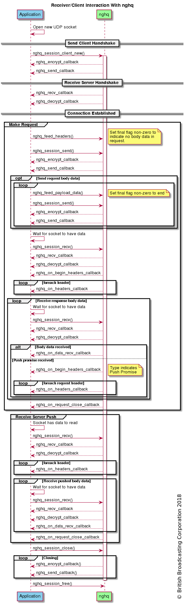
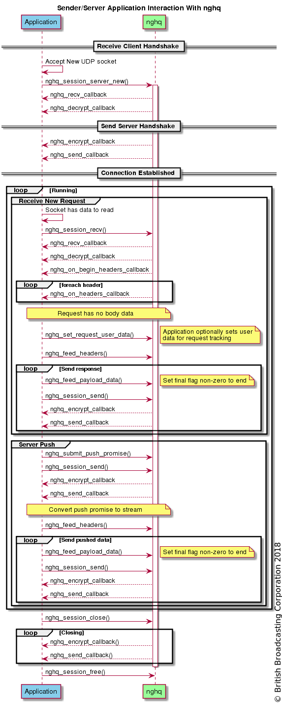

# Sequence Diagrams

These sequence diagrams show a brief example of the expected program flow between an application and the nghq library. These are hopefully helpful to aid in the process of integrating your own code against nghq.

These diagrams have been created by the PlantUML plugin for Confluence.

## Client

[Source](seq-app-client-src.txt)

## Server

[Source](seq-app-server-src.txt)